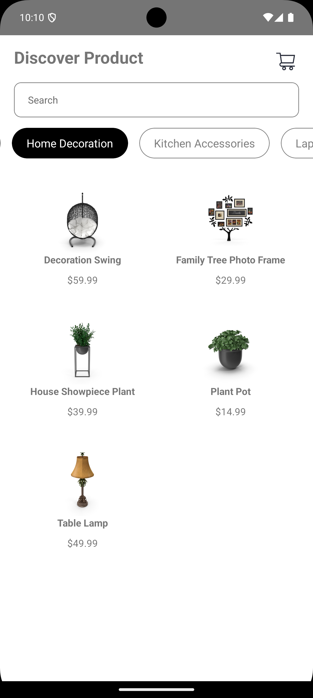
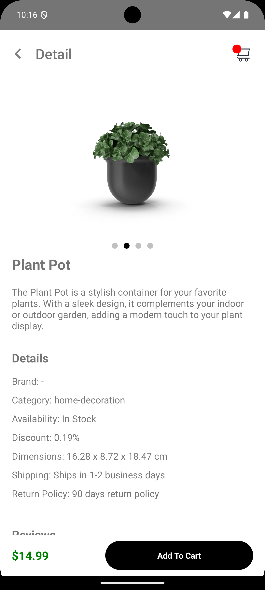
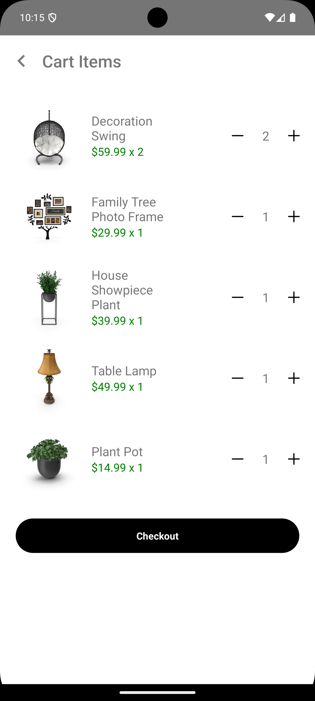
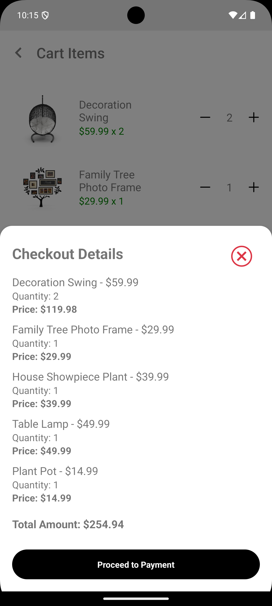
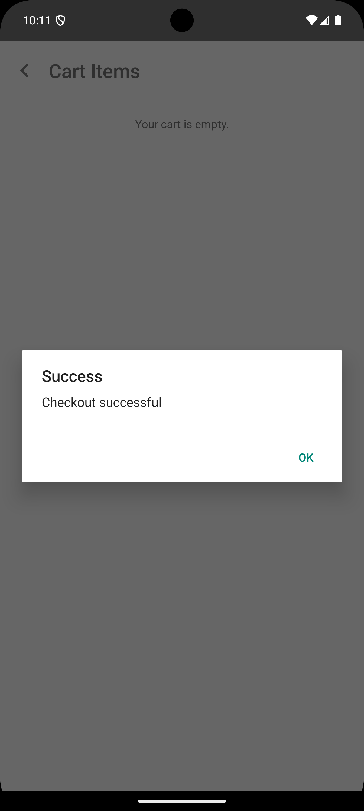

# React Native Listing Product App

This is a simple e-commerce application built with React Native that allows users to view products, add them to their cart, and proceed to checkout.

## Screenshoot
[](home.png)
[](home-filter.png)
[](detail-product.png)
[](cart.png)
[](confirm-checkout.png)
[](checkout-success.png)

## Features

- **Product Listing**
- **Cart Management**
- **Checkout Process**

this app made by API from https://dummyjson.com/docs/products

## Installation

To get started with the project, follow these steps:

1. Clone the repository:

   ```bash
   git clone https://github.com/M-Julius/Product-Listing.git
   cd Product-Listing
   ```
2. Install the necessary dependencies:
   ```
   npm install
   ```
   or
   ```
   yarn install
   ```
3. Start run the app:
   ```
   npx react-native run-android
   ```
   ios
   ```
   npx react-native run-ios
   ```